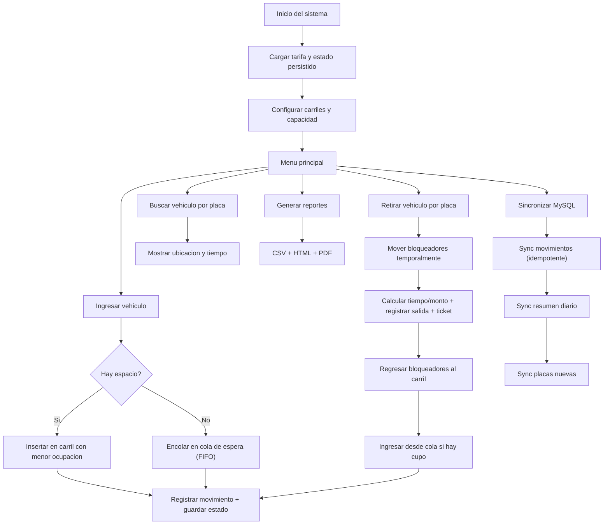

# Sistema de Parqueo (C++)

Sistema integral para administrar un parqueo de alta rotacion con carriles tipo pila (LIFO), cola de espera (FIFO), persistencia binaria en tiempo real, sincronizacion con MySQL y reportes diarios (CSV/HTML/PDF).

## Funcionalidades clave

- Gestion de ingreso/salida de vehiculos por placa.
- Carriles profundos con desbloqueo temporal para retiros intermedios.
- Cola de espera FIFO cuando el parqueo esta lleno.
- Persistencia binaria de movimientos, tarifa, placas y estado activo del parqueo.
- Recuperacion de estado tras reinicio (carriles + cola).
- Cobro por hora o fraccion (minimo 1 hora).
- Sincronizacion MySQL idempotente:
  - detalle de movimientos,
  - resumen diario,
  - placas nuevas.
- Reportes diarios en CSV, HTML y PDF.

## Arquitectura (modulos)

- `Parqueo`: logica de negocio (carriles, cola, entradas/salidas, invariantes).
- `ArchivoBinario`: persistencia local en `data/*.dat`.
- `ConexionMySQL`: sincronizacion de datos hacia base central.
- `Reportes`: agregacion diaria y exportacion CSV/HTML/PDF.
- `Utilidades`: tiempo, formato, validaciones y calculos de tarifa.
- `Ticket`: emision de ticket de salida por vehiculo.

## Flujo funcional



## Base de datos MySQL

Script: `schema.sql`

Tablas:
- `vehiculos`: placas unicas conocidas.
- `movimientos`: detalle de eventos (entrada/salida/cola/movimientos internos), con clave unica natural para idempotencia.
- `resumen_diario`: total vehiculos, monto y promedio de tiempo por fecha.

## Compilacion y ejecucion

### Sin MySQL

```bash
g++ -o SistemaParqueo main.cpp src/Vehiculo.cpp src/Movimiento.cpp src/Parqueo.cpp src/ArchivoBinario.cpp src/Reportes.cpp src/ConexionMySQL.cpp src/Ticket.cpp src/Utilidades.cpp -Iinclude -Wall -std=c++17
```

### Con MySQL

```bash
g++ -o SistemaParqueo main.cpp src/Vehiculo.cpp src/Movimiento.cpp src/Parqueo.cpp src/ArchivoBinario.cpp src/Reportes.cpp src/ConexionMySQL.cpp src/Ticket.cpp src/Utilidades.cpp -Iinclude -Wall -std=c++17 -DUSAR_MYSQL -lmysqlclient
```

### Ejecutar

- Windows: `.\SistemaParqueo.exe`
- Linux/macOS: `./SistemaParqueo`

## Configuracion de conexion MySQL (por variables de entorno)

Si compilas con `-DUSAR_MYSQL`, puedes configurar:

- `PARQUEO_DB_HOST` (default: `localhost`)
- `PARQUEO_DB_USER` (default: `root`)
- `PARQUEO_DB_PASS` (default: vacio)
- `PARQUEO_DB_NAME` (default: `sistema_parqueo`)
- `PARQUEO_DB_PORT` (default: `3306`)

## Estructura de datos local

- `data/movimientos.dat`: movimientos en binario.
- `data/tarifa.dat`: tarifa actual.
- `data/placas.dat`: placas historicas.
- `data/estado_parqueo.dat`: snapshot de estado activo (carriles + cola).
- `reportes/reporte_diario.csv|html|pdf`.
- `tickets/ticket_*.txt`.

## Validacion de release

Usa la matriz de pruebas y trazabilidad en `VALIDACION_FUNCIONAL.md` para certificar cumplimiento completo de requerimientos a-h.
